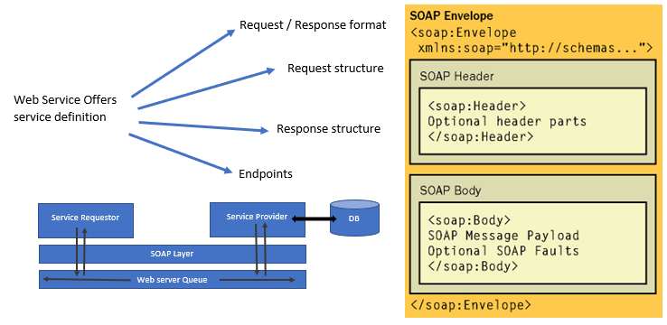

## Ravaan Techky
REST Example

### Overview:
Types of Webservices:
- SOAP
	- **SOAP** stands for **Simple Object Access Protocol**
	- **Data Exchange Format:** XML format request and response
	- **Transport:** SOAP can be used where transportation happend over the HTTP OR MQ
	- **Service Definition:** WSDL [Web Service Definition Language]. 1] Design for machine to machine OR application to application interaction. 2] Should be inter-operable i.e. not machine /platform dependent 3] should allow communication over a network.
	- 

- REST
	- **ReST** stands for **Representation State Transfer**
	- **Data Exchange Format:** No restriction. JSON (JavaScript Object Notation) is popular
	- **Transport:** Only HTTP
	- ** Service Definition:** No Standard - WADL / Swagger
	- **REST supported HTTP Method** - GET, POST, DELETE, PUT, etc.
	- **REST supported HTTP Status Codes** - 200 (Accepted), 201 (Created), 400 (Bad Request), etc.
	- Make the best use of HTTP
	- Resource can be send in request by - 1] a part of URI 2] A resource can have different representations - XML, JSON / HTML

### Important Points:
- Whenever we are saving/creating new entity in application, we need to return proper response status code. 
**Example**,- in case of creating new entity we have to return HTTP status code 201 (Created) along with URI to access that entity.

```markdown
	User newUser = this.userService.saveUser(new User("FirstName","LastName","Address"));
	URI location = ServletUriComponentBuilder.fromCurrentRequest().path("/{userId}").buildAndExpand(newUser.getUserId()).toUri();
	return ResponseEntity.created(location).build();
```
**Example**,- When requested entity/resource on server NOT FOUND, in that case REST api should also send correct HTTP response code along with proper standard response. This is very useful and helpful when there are multiple team from same organization / different organization integrating REST api for given product. We can use ResponseStatus(HttpStatus.NOT_FOUND)

```markdown
	@ResponseStatus(HttpStatus.NOT_FOUND)
	public class UserNotFoundException extends RuntimeException {
		public UserNotFoundException(String message) {
			super(message);
		}
	}
```

- To avoid sending full stack trace in REST response, following configuration need to change in **application.properties**
```markdown
server.error.include_stacktrace = never
server.error.whitelabel.enabled = false
``` 

### Exception Hanlding:
- **ResponseEntityExceptionHandler** If we would like to standardized exception handling response through out organization, we need to override methods of this class.

```markdown
@ControllerAdvice
@RestController
public class CustomResponseEntityExceptionHandler extends ResponseEntityExceptionHandler {
	@ExceptionHandler(Exception.class)
	public final ResponseEntity<Object> handleAllException(Exception exception, WebRequest request) {
		ExceptionResponse exceptionResponse = new ExceptionResponse(exception.getLocalizedMessage(), request.getDescription(true));
		return new ResponseEntity(exceptionResponse, HttpStatus.INTERNAL_SERVER_ERROR);
	}
}
```

- **ControllerAdvice** From Javadocs comments -> Specialization of {@Link Component Component}, for class that declare {@Link ExceptionHandler ExceptionHandler} - *_Exception handling to generate response using ResponseEntity_*, {@Link InitBinder InitBinder} - *_To change response format such as in respoonse we would like to change Date format_* and {@Link ModelAttribute ModelAttribute} - *_common model attribute_* methods to be shared accross multiple classes. 

- **For Handling HTTP 400 (Bad Request) Error** we can override default implementation of *_handleMethodArgumentNotValid(...)_* method. By overriding this method we can add some response body in HTTP 400 error code.

```markdown
	@Override
	protected ResponseEntity<Object> handleMethodArgumentNotValid(MethodArgumentNotValidException exception,
			HttpHeaders headers, HttpStatus status, WebRequest request) {
		ExceptionResponse exceptionResponse = new ExceptionResponse(exception.getBindingResult().toString(), request.getDescription(true));
		return new ResponseEntity(exceptionResponse, HttpStatus.BAD_REQUEST);
	}
```

<br/><br/>
[<i class="fa fa-arrow-left"></i> **Back**](/documentation/)
